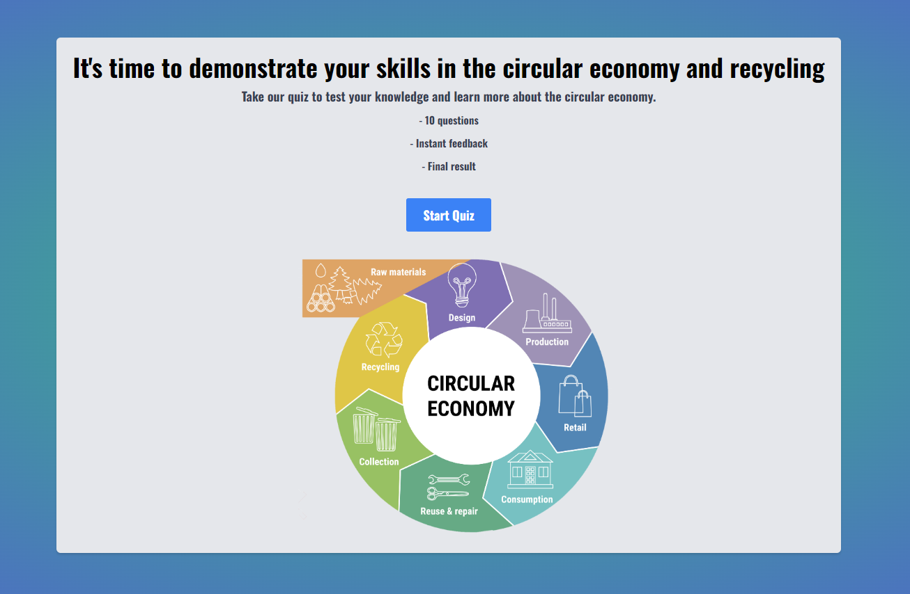
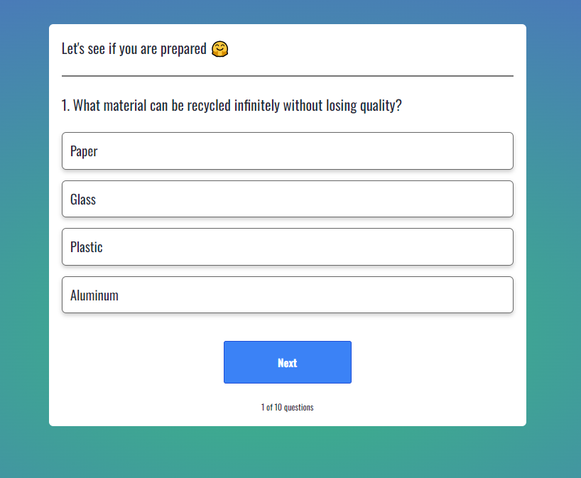
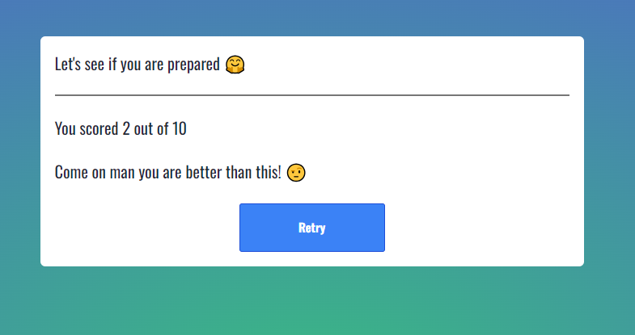

# Quiz-app



</br>



</br>



</br>

> Welcome on my web quiz-app, this quiz is about circular-economy and recycling where you can test your skills with an instant feedback and get a final result!

---

### Table of Contents

- [Description](#description)
- [How It Works](#how-it-works)
- [Author Info](#author-info)

---

## Description

This quiz-app was created using React and implementation of TypeScript to raise awareness of recycling and circular economy.

#### Technologies

- HTML
- CSS
- React
- Typescript
- Tailwind
- Visual Studio Code

[Back To The Top](#Quiz-app)

---

## How To Use

Here are the steps to test the project locally:

- Open the Visual Studio Code terminal, navigate to the project folder by typing "cd quiz-webapp" in the terminal.
- After that typing "npm install" on the terminal to Install the project dependencies found in the package.json file.
- Start the project locally by typing "npm start".

</br>The quiz consists of 10 questions, each having 4 answer options, out of which only 1 is correct. </br>
</br>As soon as the user selects an answer, it will be highlighted. If the answer chosen by the user is correct, it will be highlighted in green. However, if the user selects a wrong answer, it will be highlighted in red, and the correct answer will be highlighted too.</br>
</br>At the end of the quiz, the user's total score will be calculated based on the number of correct and incorrect answers. Finally, the user will receive a score-based judgment.

#### API Reference

- Little example of one of the consts that I used for give the final score-base judgment.

</br>

```javascript
const skill = (): string => {
    if (score <= 4 ) {
      return "Come on man you are better than this! 🤨"
    } else if (score > 4 && score < 6) {
      return "Almost there buddy but you have to know a little bit more 🤔 "
    }else if (score > 6 && score <= 8) {
      return "You're good but not great yet 😜 "
    }else {
      return "You're the man! 😝 "
    }
```

[Back To The Top](#Quiz-app)

---

## Author Info

I wll see you on my social media!

- Twitter - [@GabrielValorianiFranco](https://twitter.com/GabrielValoria)
- Linkedin - [GabrielValoriani](https://www.linkedin.com/in/gabriel-valoriani-franco-9971a3291/)

[Back To The Top](#Quiz-app)
